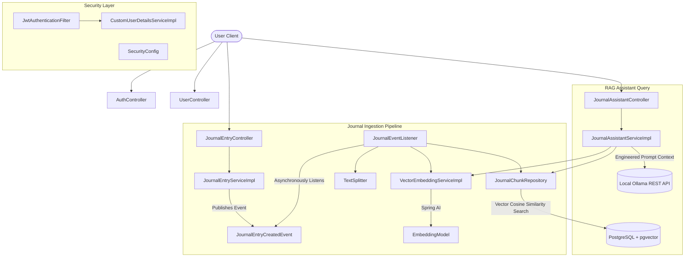

# Cognify Journal

Cognify Journal is an AI-assisted journaling backend application built using Spring Boot. It allows users to write secure journal entries, automatically chunks and indexes the entries into vector embeddings stored in a PostgreSQL database using `pgvector`, and provides analytical AI-driven insights through a Retrieval-Augmented Generation (RAG) assistant running on a local Ollama LLM container.

The AI assistant is strictly designed to evaluate the factual context of historical journal entries and offer objective patterns while intentionally avoiding emotional advice, therapy, or medical/psychological diagnoses.

---

## Architecture & Data Flow

The project is structured as a **Modular Monolith** using **Feature-based Packaging** to ensure clean separation of concerns and a highly maintainable and testable codebase:



### Ingestion Pipeline (Asynchronous Vectorization)
1. **Journal Creation**: The user creates a new journal entry via [JournalEntryController](file:///Users/aditichoudhary/backendProjects/cognify-journal/src/main/java/com/aditi/cognify_journal/journal/controller/JournalEntryController.java).
2. **Event Dispatched**: [JournalEntryServiceImpl](file:///Users/aditichoudhary/backendProjects/cognify-journal/src/main/java/com/aditi/cognify_journal/journal/service/impl/JournalEntryServiceImpl.java) saves the entry and publishes a [JournalEntryCreatedEvent](file:///Users/aditichoudhary/backendProjects/cognify-journal/src/main/java/com/aditi/cognify_journal/journal/event/JournalEntryCreatedEvent.java).
3. **Background Processing**: The [JournalEventListener](file:///Users/aditichoudhary/backendProjects/cognify-journal/src/main/java/com/aditi/cognify_journal/journal/service/impl/JournalEventListener.java) intercepts the event asynchronously using Spring's `@Async` scheduler.
4. **Text Chunking**: The entry is sliced into chunks of maximum 500 characters with a 50-character overlap for semantic continuity using [TextSplitter](file:///Users/aditichoudhary/backendProjects/cognify-journal/src/main/java/com/aditi/cognify_journal/journal/util/TextSplitter.java).
5. **Embedding Generation**: Vector embeddings (768-dimension vectors) are generated for each chunk using [VectorEmbeddingServiceImpl](file:///Users/aditichoudhary/backendProjects/cognify-journal/src/main/java/com/aditi/cognify_journal/journal/service/impl/VectorEmbeddingServiceImpl.java) backed by Spring AI's `EmbeddingModel` connection to a local Ollama model (`nomic-embed-text`).
6. **Vector Storage**: The resulting [JournalChunk](file:///Users/aditichoudhary/backendProjects/cognify-journal/src/main/java/com/aditi/cognify_journal/journal/entity/JournalChunk.java) entities are stored in the database.

### Assistant Query Pipeline (Retrieval-Augmented Generation)
1. **Submit Query**: The user queries the assistant endpoint at [JournalAssistantController](file:///Users/aditichoudhary/backendProjects/cognify-journal/src/main/java/com/aditi/cognify_journal/assistant/controller/JournalAssistantController.java).
2. **Retrieve Context**: [JournalAssistantServiceImpl](file:///Users/aditichoudhary/backendProjects/cognify-journal/src/main/java/com/aditi/cognify_journal/assistant/service/impl/JournalAssistantServiceImpl.java) generates a vector embedding for the query, then performs a Cosine Distance vector similarity search against the user's journal chunks using [JournalChunkRepository](file:///Users/aditichoudhary/backendProjects/cognify-journal/src/main/java/com/aditi/cognify_journal/journal/repository/JournalChunkRepository.java).
3. **LLM Generation**: The retrieved text chunks are injected into a highly constrained system prompt. The prompt is sent to the local Ollama API (running `llama3`) to construct an objective, fact-based answer without any emotional assumptions or therapeutic advice.

---

## Tech Stack

* **Language**: Java 17
* **Framework**: Spring Boot 3.5.0
* **Security**: Spring Security & JSON Web Tokens (JWT)
* **ORM / Database Access**: Spring Data JPA & Hibernate Vector (for raw pgvector type mapping)
* **Database**: PostgreSQL (utilizing the `pgvector` extension)
* **AI & Embeddings**: Spring AI (Ollama Starter)
* **Local LLM Orchestrator**: Ollama (configured with `llama3` and `nomic-embed-text`)
* **Environment Configuration**: Spring Dotenv (for `.env` loading)
* **Build Tool**: Maven

---

## Core Project Files & Structure

Below is an overview of the primary directories and codebase entries:

* **Configuration**:
  * Security configurations & Filters: [SecurityConfig.java](file:///Users/aditichoudhary/backendProjects/cognify-journal/src/main/java/com/aditi/cognify_journal/config/SecurityConfig.java) | [JwtAuthenticationFilter.java](file:///Users/aditichoudhary/backendProjects/cognify-journal/src/main/java/com/aditi/cognify_journal/auth/filter/JwtAuthenticationFilter.java)
  * RestTemplate & Web Beans: [WebConfig.java](file:///Users/aditichoudhary/backendProjects/cognify-journal/src/main/java/com/aditi/cognify_journal/config/WebConfig.java)
  * Application Settings: [application.properties](file:///Users/aditichoudhary/backendProjects/cognify-journal/src/main/resources/application.properties)
* **Core Application Entrypoint**:
  * [CognifyJournalApplication.java](file:///Users/aditichoudhary/backendProjects/cognify-journal/src/main/java/com/aditi/cognify_journal/CognifyJournalApplication.java) (annotated with `@EnableAsync` to allow background tasks)
* **User Management Module**:
  * Entity & Repository: [User.java](file:///Users/aditichoudhary/backendProjects/cognify-journal/src/main/java/com/aditi/cognify_journal/user/entity/User.java) | [UserRepository.java](file:///Users/aditichoudhary/backendProjects/cognify-journal/src/main/java/com/aditi/cognify_journal/user/repository/UserRepository.java)
  * Controller: [UserController.java](file:///Users/aditichoudhary/backendProjects/cognify-journal/src/main/java/com/aditi/cognify_journal/user/controller/UserController.java)
  * Services: [UserService.java](file:///Users/aditichoudhary/backendProjects/cognify-journal/src/main/java/com/aditi/cognify_journal/user/service/UserService.java) | [UserServiceImpl.java](file:///Users/aditichoudhary/backendProjects/cognify-journal/src/main/java/com/aditi/cognify_journal/user/service/impl/UserServiceImpl.java)
* **Authentication Module**:
  * Controller: [AuthController.java](file:///Users/aditichoudhary/backendProjects/cognify-journal/src/main/java/com/aditi/cognify_journal/auth/controller/AuthController.java)
  * Services: [AuthService.java](file:///Users/aditichoudhary/backendProjects/cognify-journal/src/main/java/com/aditi/cognify_journal/auth/service/AuthService.java) | [AuthServiceImpl.java](file:///Users/aditichoudhary/backendProjects/cognify-journal/src/main/java/com/aditi/cognify_journal/auth/service/impl/AuthServiceImpl.java)
  * User Details Provider: [CustomUserDetailsService.java](file:///Users/aditichoudhary/backendProjects/cognify-journal/src/main/java/com/aditi/cognify_journal/auth/service/CustomUserDetailsService.java) | [CustomUserDetailsServiceImpl.java](file:///Users/aditichoudhary/backendProjects/cognify-journal/src/main/java/com/aditi/cognify_journal/auth/service/impl/CustomUserDetailsServiceImpl.java)
  * JWT Token Management: [JwtService.java](file:///Users/aditichoudhary/backendProjects/cognify-journal/src/main/java/com/aditi/cognify_journal/auth/jwt/JwtService.java) | [JwtServiceImpl.java](file:///Users/aditichoudhary/backendProjects/cognify-journal/src/main/java/com/aditi/cognify_journal/auth/jwt/impl/JwtServiceImpl.java)
* **Journal Entry & Vector Module**:
  * Entities & Repositories: [JournalEntry.java](file:///Users/aditichoudhary/backendProjects/cognify-journal/src/main/java/com/aditi/cognify_journal/journal/entity/JournalEntry.java) | [JournalEntryRepository.java](file:///Users/aditichoudhary/backendProjects/cognify-journal/src/main/java/com/aditi/cognify_journal/journal/repository/JournalEntryRepository.java) | [JournalChunk.java](file:///Users/aditichoudhary/backendProjects/cognify-journal/src/main/java/com/aditi/cognify_journal/journal/entity/JournalChunk.java) | [JournalChunkRepository.java](file:///Users/aditichoudhary/backendProjects/cognify-journal/src/main/java/com/aditi/cognify_journal/journal/repository/JournalChunkRepository.java)
  * Controller: [JournalEntryController.java](file:///Users/aditichoudhary/backendProjects/cognify-journal/src/main/java/com/aditi/cognify_journal/journal/controller/JournalEntryController.java)
  * Services: [JournalEntryService.java](file:///Users/aditichoudhary/backendProjects/cognify-journal/src/main/java/com/aditi/cognify_journal/journal/service/JournalEntryService.java) | [JournalEntryServiceImpl.java](file:///Users/aditichoudhary/backendProjects/cognify-journal/src/main/java/com/aditi/cognify_journal/journal/service/impl/JournalEntryServiceImpl.java)
  * Asynchronous Events: [JournalEntryCreatedEvent.java](file:///Users/aditichoudhary/backendProjects/cognify-journal/src/main/java/com/aditi/cognify_journal/journal/event/JournalEntryCreatedEvent.java) | [JournalEventListener.java](file:///Users/aditichoudhary/backendProjects/cognify-journal/src/main/java/com/aditi/cognify_journal/journal/service/impl/JournalEventListener.java)
  * Embeddings Generation: [VectorEmbeddingService.java](file:///Users/aditichoudhary/backendProjects/cognify-journal/src/main/java/com/aditi/cognify_journal/journal/service/VectorEmbeddingService.java) | [VectorEmbeddingServiceImpl.java](file:///Users/aditichoudhary/backendProjects/cognify-journal/src/main/java/com/aditi/cognify_journal/journal/service/impl/VectorEmbeddingServiceImpl.java)
  * Text Chunking Utility: [TextSplitter.java](file:///Users/aditichoudhary/backendProjects/cognify-journal/src/main/java/com/aditi/cognify_journal/journal/util/TextSplitter.java)
* **AI RAG Assistant Module**:
  * Controller: [JournalAssistantController.java](file:///Users/aditichoudhary/backendProjects/cognify-journal/src/main/java/com/aditi/cognify_journal/assistant/controller/JournalAssistantController.java)
  * Services: [JournalAssistantService.java](file:///Users/aditichoudhary/backendProjects/cognify-journal/src/main/java/com/aditi/cognify_journal/assistant/service/JournalAssistantService.java) | [JournalAssistantServiceImpl.java](file:///Users/aditichoudhary/backendProjects/cognify-journal/src/main/java/com/aditi/cognify_journal/assistant/service/impl/JournalAssistantServiceImpl.java)
* **Global Error Handling**:
  * Controller Advisor: [GlobalExceptionHandler.java](file:///Users/aditichoudhary/backendProjects/cognify-journal/src/main/java/com/aditi/cognify_journal/exception/GlobalExceptionHandler.java)
* **Build & Configurations**:
  * Project Build File: [pom.xml](file:///Users/aditichoudhary/backendProjects/cognify-journal/pom.xml)
  * Local Variables: [.env](file:///Users/aditichoudhary/backendProjects/cognify-journal/.env)

---

## Setup & Installation

### 1. Prerequisites
Ensure you have the following installed on your local machine:
- **Java Development Kit (JDK) 17**
- **Maven** (or use the packaged wrapper `./mvnw`)
- **PostgreSQL Database** with **pgvector** installed
- **Ollama** (for local LLM and embedding support)

### 2. Database Configuration
You need to have a PostgreSQL instance running. Start by creating the project database:
```sql
CREATE DATABASE cognify_journal;
```
Once the database is created, make sure to enable the `pgvector` extension by running the following SQL statement in the database console:
```sql
CREATE EXTENSION IF NOT EXISTS vector;
```

### 3. Environment Variables
Create a file named `.env` in the root directory of the project (if it doesn't already exist). Below is an example config template based on [the project's environment file](file:///Users/aditichoudhary/backendProjects/cognify-journal/.env):
```ini
# Application Secrets

# Database Configuration
DB_URL=jdbc:postgresql://localhost:5432/cognify_journal
DB_USERNAME=your_database_username
DB_PASSWORD=your_database_password

# Ollama Orchestration Endpoint
AI_OLLAMA_BASE_URL=http://localhost:11434
```

### 4. Local Ollama LLM Services
Ensure Ollama is running locally, then pull the required models:
* **Text Embeddings model**:
  ```bash
  ollama pull nomic-embed-text
  ```
* **Text Generation model** (used by the RAG assistant):
  ```bash
  ollama pull llama3
  ```

---

## Running the Application

1. **Build the JAR**:
   ```bash
   ./mvnw clean install
   ```
2. **Start the application**:
   ```bash
   ./mvnw spring-boot:run
   ```
   The backend service starts running at `http://localhost:8080`.

---

## API Documentation

Below is the list of endpoints exposed by the service. All endpoints except registration and login require a valid bearer JWT token passed in the `Authorization` header (`Authorization: Bearer <token>`).

### 1. Authentication
* **User Registration**
  * **Endpoint**: `POST /api/users/register`
  * **Auth Required**: No
  * **Payload Request**:
    ```json
    {
      "name": "Jane Doe",
      "email": "jane@example.com",
      "password": "strongPassword123"
    }
    ```
* **User Login**
  * **Endpoint**: `POST /api/auth/login`
  * **Auth Required**: No
  * **Payload Request**:
    ```json
    {
      "email": "jane@example.com",
      "password": "strongPassword123"
    }
    ```
  * **Payload Response**:
    ```json
    {
      "token": "eyJhbGciOiJIUzI1NiJ9..."
    }
    ```

### 2. User Settings
* **Get Current Profile**
  * **Endpoint**: `GET /api/users/me`
  * **Auth Required**: Yes
* **Get User Journal List**
  * **Endpoint**: `GET /api/users/me/journals`
  * **Auth Required**: Yes
* **Update Profile Details**
  * **Endpoint**: `PUT /api/users/me`
  * **Auth Required**: Yes
* **Delete Account**
  * **Endpoint**: `DELETE /api/users/me`
  * **Auth Required**: Yes

### 3. Journal Entries
* **Create Journal Entry**
  * **Endpoint**: `POST /api/journals`
  * **Auth Required**: Yes
  * **Payload Request**:
    ```json
    {
      "title": "A Reflective Evening",
      "content": "Today, I spent some time walking by the park. It helped clear my mind..."
    }
    ```
* **Retrieve Entry by ID**
  * **Endpoint**: `GET /api/journals/{id}`
  * **Auth Required**: Yes
* **Update Entry**
  * **Endpoint**: `PUT /api/journals/{id}`
  * **Auth Required**: Yes
  * **Payload Request**:
    ```json
    {
      "title": "A Reflective Evening (Updated)",
      "content": "Today, I spent some time walking by the park. I noticed how quiet the water was..."
    }
    ```
* **Delete Entry**
  * **Endpoint**: `DELETE /api/journals/{id}`
  * **Auth Required**: Yes

### 4. AI Query Assistant
* **Ask Assistant (RAG Query)**
  * **Endpoint**: `POST /api/assistant/query`
  * **Auth Required**: Yes
  * **Payload Request**:
    ```json
    {
      "query": "What patterns do you notice in my walking habits or outdoor activity?"
    }
    ```
  * **Payload Response**:
    ```json
    {
      "answer": "Based on your journal history, you wrote that walking by the park helps clear your mind and that you observed the quiet water during an outdoor walk. No other active patterns or specific routines were explicitly identified."
    }
    ```
